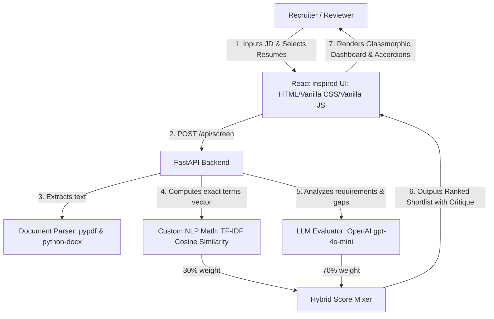

# AI Resume Screening Agent 🚀

A professional, end-to-end resume ranking and gap-analysis agent built for the HR & Recruitment track of the 24-Hour AI Challenge. It parses multiple resumes (PDF, DOCX, TXT) and ranks them against a given Job Description (JD) using a hybrid scoring algorithm: **classical NLP TF-IDF Cosine Similarity** + **GPT Semantic Evaluation**.

---

## 🛠 Architecture & Tech Stack



*   **Backend**: FastAPI, Python 3.11
*   **NLP Core**: Pure-Python TF-IDF vector space modelling & Cosine Similarity (no heavy `scikit-learn` or `numpy` dependencies, ensuring 100% install reliability)
*   **LLM Brain**: OpenAI `gpt-4o-mini` with Pydantic JSON-schema formatting
*   **Document Parsers**: `pypdf` (PDF), `python-docx` (Word/DOCX), native system encodings (TXT/MD)
*   **Frontend**: Single-page App (HTML5 / Vanilla CSS3 Custom Tokens / Vanilla Javascript)

---

## 🌟 Key Features

1.  **Multi-format Parsing**: Extracts text from digital PDF, DOCX, and TXT documents.
2.  **Hybrid Scoring Algorithm**: Combines direct term-matching (TF-IDF Cosine Similarity) with semantic analysis (LLM experience check, years of experience audit, missing requirements review).
3.  **Graceful Key Fallback**: If no OpenAI API Key is provided, the agent runs in **Classical NLP mode**, utilizing keyword cosine similarity and heuristics, allowing full offline operation.
4.  **1-Click Demo Seed**: Instantly generates 10+ realistic sample resume profiles across varied professions (Python developers, designers, PMs, QA) directly onto your disk to test the pipeline instantly without downloading external files.
5.  **Premium Glassmorphic UI**: Beautiful dark-mode dashboard featuring interactive sliders, progress stepper bars, and candidate details accordions.

---

## 📂 Project Directory Structure

```text
resume-screener/
├── backend/
│   ├── temp/                     # Temporary upload directory
│   ├── sample_resumes/           # Generated test resumes (PDF/DOCX/TXT)
│   ├── main.py                   # FastAPI Application routes & seeds
│   ├── nlp_utils.py              # Term Frequency-Inverse Document Frequency math
│   ├── parser_utils.py           # PyPDF / DOCX document parsers
│   ├── test_nlp.py               # Validation test suite for cosine calculations
│   └── requirements.txt          # Python packages
├── frontend/
│   ├── index.html                # Dashboard Structure
│   ├── style.css                 # Dark-mode styles, borders, & transitions
│   └── app.js                    # API bindings & dynamic accordions
├── README.md                     # Setup guide
└── tradeoffs.md                  # Detailed design and mathematical notes
```

---

## 🚀 Installation & Setup (Foolproof)

Follow these steps in your Windows terminal to boot the server locally.

### Step 1: Open Terminal & Navigate
Open PowerShell or Command Prompt at the project root:
```powershell
cd c:\Users\Satya\Desktop\prjs\resume-screener\backend
```

### Step 2: Initialize Virtual Environment
Create and activate the virtual environment:
```powershell
# Create venv
python -m venv venv

# Activate on Windows PowerShell
.\venv\Scripts\Activate.ps1
```

### Step 3: Install Packages
Install dependencies (ensuring `python-multipart` is included):
```powershell
pip install -r requirements.txt
```

### Step 4: Configure API Keys (Optional)
Create a `.env` file inside the `backend/` directory:
```env
OPENAI_API_KEY=your-actual-api-key-here
```
> **Note**: If you omit this file or leave it blank, the backend will display a warning on launch and gracefully boot in **Classical NLP Mode**, sorting candidates solely by cosine similarity metrics.

### Step 5: Start Server
Run the FastAPI application. It will automatically seed the 10+ resume files into `backend/sample_resumes/` on startup:
```powershell
python main.py
```
The console will print:
`INFO: Uvicorn running on http://127.0.0.1:8000`

---

## 🔍 Verification & Demonstration Walkthrough

Once the server is running, follow this 1-minute verification script:

1.  Open your browser and navigate to: **[http://127.0.0.1:8000](http://127.0.0.1:8000)** (the backend serves the frontend static assets directly).
2.  Observe the status badge in the top-right corner. It should say:
    *   `OpenAI Hybrid Mode Active` (if your key is configured) OR
    *   `Classical NLP (Offline Mode)` (if running in local fallback).
3.  Click the **"Seed 10+ Demo Resumes"** button. The dashboard will instantly generate 10+ candidate files on your disk and display them in the files panel.
4.  Select a **Job Description Template** (e.g., **"Python Developer"**).
5.  Click the glowing **"Screen & Rank Resumes"** button.
6.  The loader stepper will progress through:
    *   *Parsing Candidate Files*
    *   *TF-IDF Semantic Filtering*
    *   *LLM Gap Analysis*
7.  Verify the shortlist results render:
    *   **Sarah Jenkins** (Senior Python Developer) must rank **#1** for the Python template.
    *   Click on Sarah's card to expand her profile. Review the extracted skills, summary, strengths, and gap analysis.
    *   Switch templates (e.g., click **"React Developer"**), re-run screening, and verify that **Amanda White** (Frontend React Developer) is automatically promoted to the top rank.
